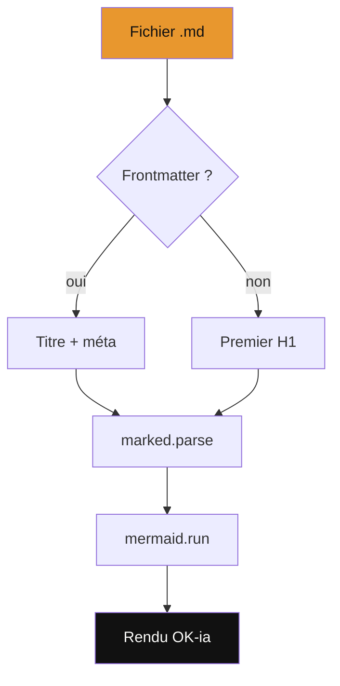
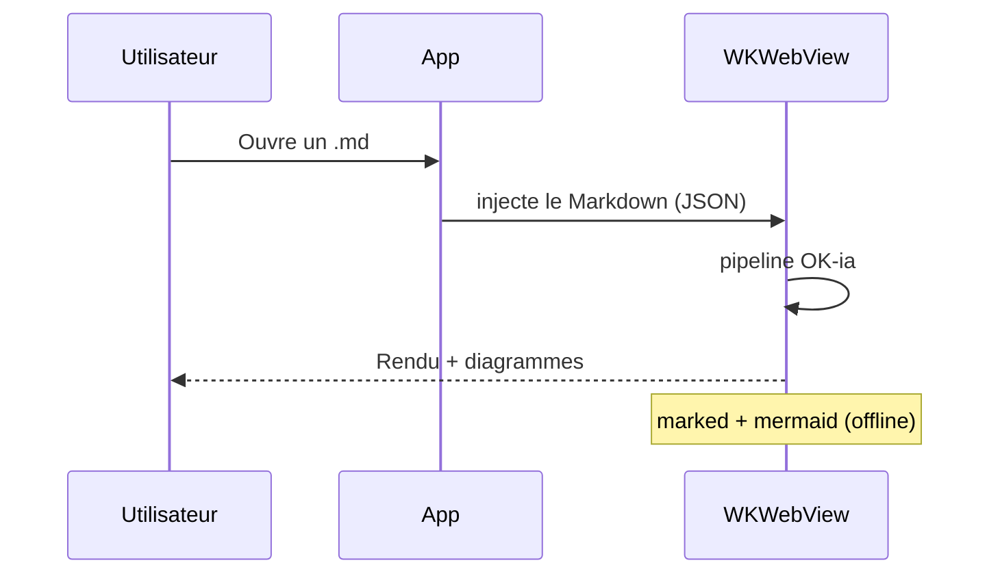
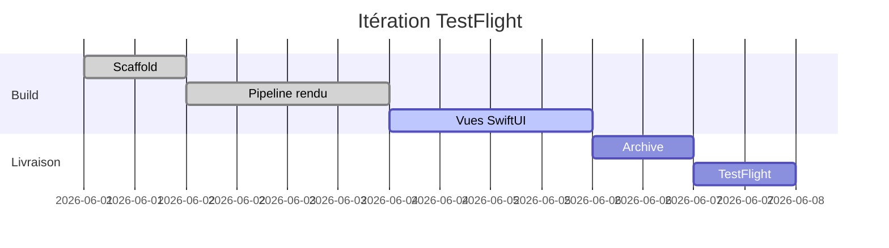
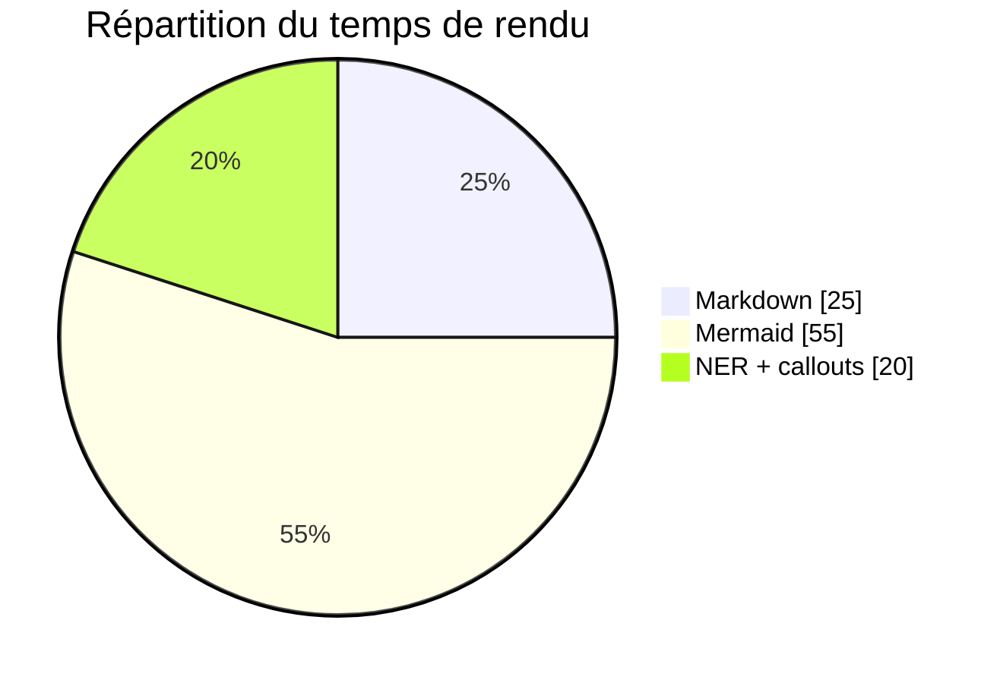
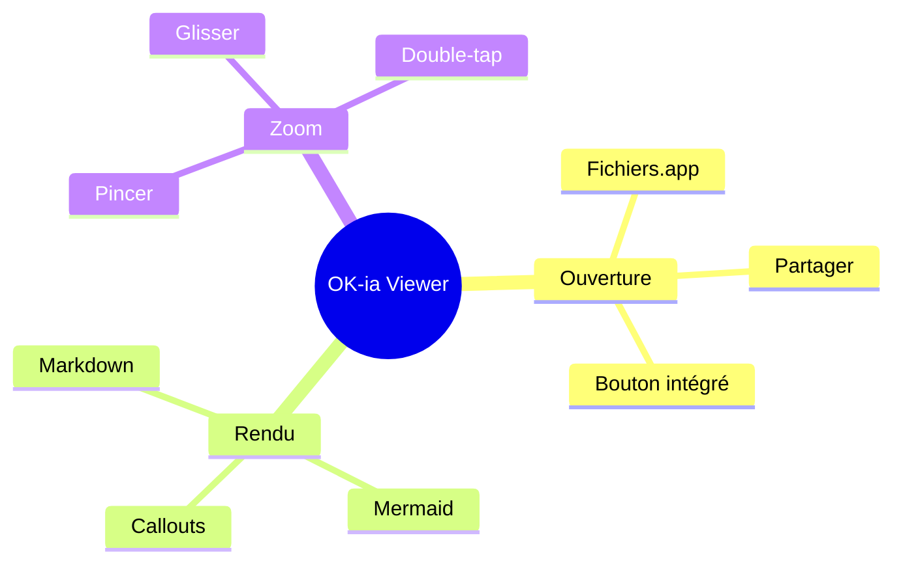

# Démonstration OK-ia Viewer

Ce document met en évidence le rendu Markdown + Mermaid de l'application, fidèle au viewer
de [[ok-ia.ch]]. Il couvre les **callouts**, les *wiki-links*, la coloration des entités (NER)
et plusieurs types de diagrammes.

> [!tip] Astuce
> Touchez n'importe quel diagramme pour l'ouvrir en plein écran : pincez pour zoomer,
> glissez pour vous déplacer, double-tapez pour (dé)zoomer.

> [!warning] À savoir
> L'application fonctionne **100 % hors-ligne**. Les bibliothèques `marked` et `mermaid`
> sont embarquées dans l'app.

## Flowchart



## Diagramme de séquence



## Diagramme de Gantt



## Camembert (pie)



## Mindmap



## Carte géographique

Bloc `leaflet` à la façon d'Obsidian — points positionnés, fond de carte CARTO,
bouton plein écran (⛶) pour naviguer en portrait ou paysage.

```leaflet
id: demo-afrique-est
minZoom: 2
maxZoom: 12
height: 460px
marker: 0.347, 32.582, [[Kampala]]
marker: -1.943, 30.059, [[Kigali]]
marker: -3.373, 29.360, [[Bujumbura]]
marker: 7.862, 29.694, [[Soudan du Sud]]
marker: -4.322, 15.307, [[Kinshasa]]
```

## Tableau

| Fonction        | État    |
|-----------------|---------|
| Ouverture .md   | ✅      |
| Mermaid         | ✅      |
| Zoom diagramme  | ✅      |
| Hors-ligne      | ✅      |

## Entités

### Organisations
- [[OK-ia]]
- [[Apple]]

### Produits
- [[TestFlight]]
- [[WKWebView]]

### Personnes
- [[Patrick Ostertag]]

Le projet OK-ia s'appuie sur WKWebView d'Apple et sera distribué via TestFlight.
Patrick Ostertag pilote l'itération.
