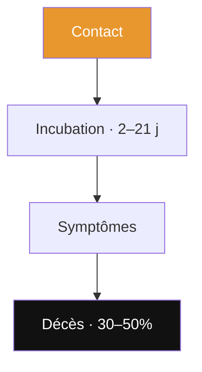

# Guide — rédiger une présentation pour « md Viewer » (mode Diaporama)

Ce guide décrit le format Markdown qu'attend le **mode Diaporama** de *md Viewer* et donne les
bonnes pratiques pour un rendu net en plein écran. Il sert aussi d'instructions à coller dans une
configuration d'assistant (Claude, etc.) pour générer des présentations directement exploitables.

> Le diaporama s'ouvre via le bouton **▶︎ Diaporama** du lecteur, visible dès qu'un document
> contient **au moins 2 diapositives**.

---

## Structure du fichier

Produire **un seul fichier Markdown** (`.md`).

1. **Frontmatter YAML** en tête (recommandé) :
   ```yaml
   ---
   title: Titre de la présentation
   date: 2026-05-19          # format AAAA-MM-JJ
   type: presentation
   tags: [sujet, theme]
   ---
   ```
2. **Une diapositive par bloc**, séparées par une ligne contenant uniquement `---`.
   - Le `---` de fermeture du frontmatter ne compte pas comme séparateur.
   - Les `---` situés **dans** un bloc de code ` ``` ` sont ignorés.

---

## Règle d'or : une idée par diapositive

Le moteur **réduit automatiquement** une diapo trop chargée → elle devient petite. Garder chaque
diapo aérée :

- Diapo de texte : **≤ ~40 mots**, **≤ 6 puces**.
- Tableau : **≤ 6 lignes / 4 colonnes**.
- **1 seule idée** et **1 seul média principal** par diapo.

Préférer **plus de diapos courtes** que peu de diapos denses.

---

## Images inline (par URL)

Syntaxe : ``

- Utiliser des **URL HTTPS publiques et directes** vers un fichier image (`.jpg`/`.png`/`.webp`),
  chargeables sans authentification ni anti-hotlink (Wikimedia, CDN d'actualité, etc.).
- **Une seule image par diapo** : elle est alors **agrandie pour remplir la diapo**. Plusieurs
  images sur une même diapo restent petites → à éviter.
- **Haute résolution** : les petites images sont mises à l'échelle et deviennent floues. Viser
  **≥ 1000 px sur le grand côté** (davantage si l'image occupe toute la diapo).
  *Astuce Wikimedia* : dans une URL `…/thumb/…/500px-Nom.jpg`, remplacer `500px` par `1280px`.
- **Légende** : ajouter une citation juste sous l'image :
  ```markdown
  

  > Nom · rôle · détail clé en **gras**
  ```
- Les **URL injoignables sont supprimées silencieusement** à l'affichage → vérifier que chaque lien
  renvoie bien une image (pas une page HTML).
- Dans l'app, **un tap sur l'image l'ouvre en plein écran** (zoom).

---

## Contenu pris en charge sur une diapositive

- **Titres** `#` (titre principal), `##` (titre de diapo), `###`.
- **Gras**, *italique*, listes, **tableaux** (GFM), citations `>`.
- **Diagrammes Mermaid** — bloc ` ```mermaid ` : `flowchart`, `timeline`, `pie`, `quadrantChart`,
  `xychart-beta`, `sequenceDiagram`… Garder lisible (**≤ ~8 nœuds**). Saut de ligne dans un libellé
  = `\n`. Palette OK-ia possible :
  ```mermaid
  flowchart TD
    A["Contact"] --> B["Décès 30–50%"]
    style A fill:#E8972E,color:#fff
    style B fill:#111,color:#fff
  ```
  Couleurs utiles : orange `#E8972E`, noir `#111`, vert `#2d5a1b`, bleu `#1a3a5c`.
- **Cartes interactives** — bloc ` ```leaflet ` (remplit la diapo) :
````markdown
```leaflet
id: carte-unique
lat: 1.5
long: 28.5
defaultZoom: 4
marker: default,1.57,30.22,[[Bunia · épicentre]]
marker: default,-1.68,29.22,[[Goma]]
```
````
- **Callouts** Obsidian : `> [!warning] Titre`, `[!note]`, `[!tip]`, `[!info]`…
- **Liens wiki** `[[Nom]]` (affichés stylés).

---

## Modèles de diapositives

- **Titre** : `#` Titre + `##` sous-titre + `>` source/auteur.
- **Idée clé** : `##` Titre + 3–5 puces **ou** un tableau court.
- **Visuel** : `##` Titre + 1 image (ou 1 diagramme, ou 1 carte) + `>` légende.
- **Citation** : une `>` courte et forte, rien d'autre.

---

## À ne pas faire

- Pas de diapos « murs de texte » (elles rétrécissent).
- Pas plusieurs grosses images / diagrammes sur la même diapo.
- Ne **pas** gérer les transitions dans le Markdown : elles se choisissent dans l'app (menu **⚙**).
  Se concentrer sur le contenu.

---

## Commandes du diaporama (côté lecteur)

| Action | Geste / touche |
|--------|----------------|
| Diapo suivante / précédente | flèches **←/→**, **espace**, balayage tactile, flèches à l'écran |
| Choisir la **transition** | bouton **⚙** (Fondu, Poussée, Entrée, Échelle, Retournement 3D) |
| **Vue d'ensemble** (grille de vignettes) | bouton **▦**, puis cliquer une vignette |
| **Quitter** le diaporama | bouton **✕** ou touche **Échap** |

---

## Exemple minimal

````markdown
---
title: Ebola Bundibugyo 2026
type: presentation
---

# 🦠 Ebola Bundibugyo
## Retour d'un spectre africain

> Rapport de veille · 19 mai 2026

---

## Situation au 18 mai

| Indicateur | Valeur |
|-----------|--------|
| Décès probables | **91** |
| Cas suspects | **350** |

---

## Progression clinique



---

## Jean-Jacques Muyembe


> Virologue congolais · Co-découvreur d'Ebola en **1976**
````

> **Livraison attendue d'un assistant** : un fichier `.md` complet, prêt à ouvrir dans *md Viewer*
> puis ▶︎ Diaporama.
