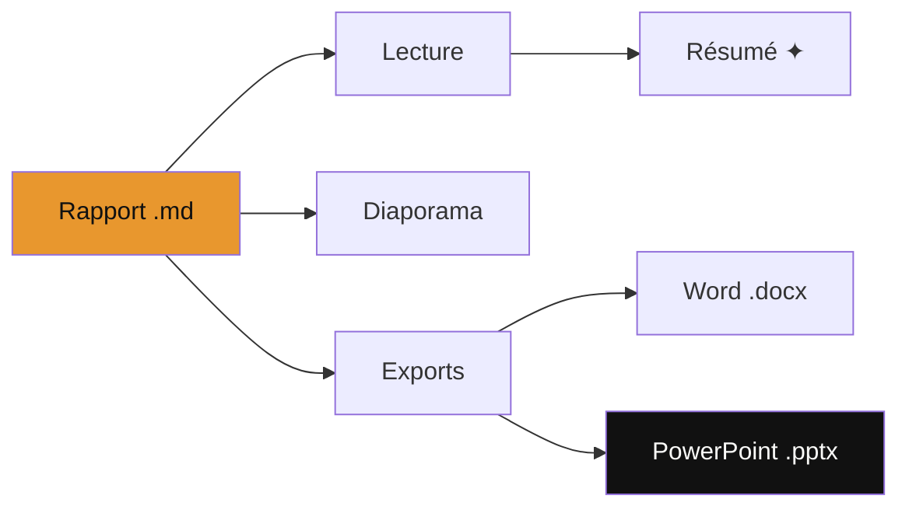
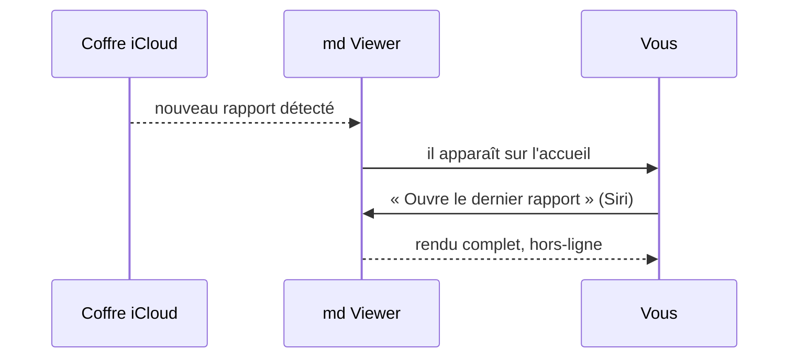
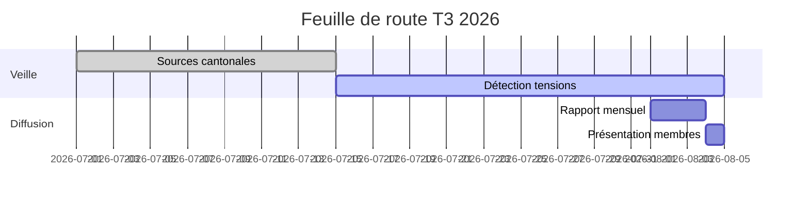
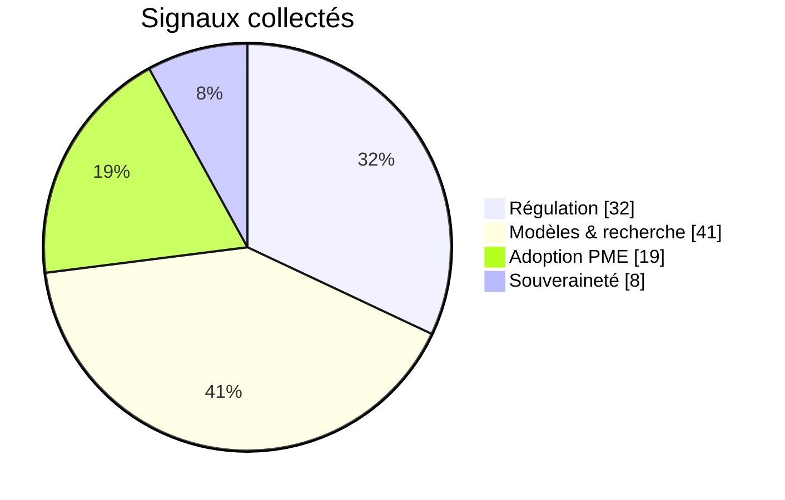
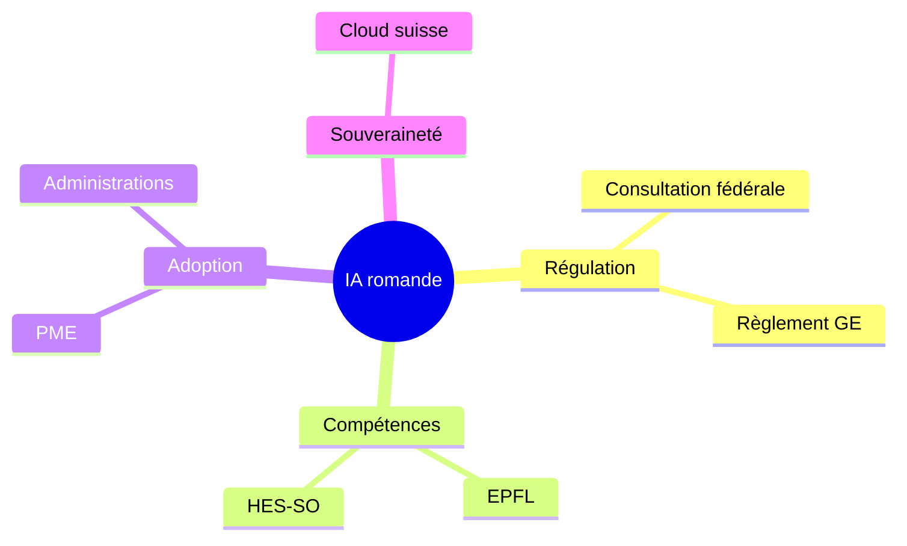

# md Viewer

**Vos rapports Markdown, rendus parfaitement.**

Avancez d'un tap, aux flèches ← →, à la barre d'espace ou d'un glissement.

*Échap ou ✕ pour quitter · ▦ pour la vue d'ensemble · ⚙ pour les réglages*

---

## Au programme

1. Une diapositive par bloc séparé par `---` — rien d'autre à apprendre
2. Les **cinq familles Mermaid** : flowchart, séquence, gantt, pie, mindmap
3. Une **carte Leaflet** interactive
4. Tableaux, callouts, entités colorées
5. **Cinq thèmes**, **cinq transitions**, export **PowerPoint**

> [!tip] Tout de suite
> Touchez **⚙** et changez le thème : Clair, Sombre, Console, Sépia, Océan.
> Votre choix est mémorisé pour la prochaine fois.

---

## Flowchart — un flux, trois usages



---

## Séquence — du coffre à l'écran



---

## Gantt — le trimestre en un regard



---

## Pie — la semaine en parts



---

## Mindmap — les idées en étoile



---

## La Suisse romande en carte

Les cartes restent interactives en plein diaporama — et passent en plein écran.

```leaflet
id: presentation-romandie
minZoom: 7
maxZoom: 13
height: 430px
marker: 46.2044, 6.1432, [[Genève]]
marker: 46.5197, 6.6323, [[Lausanne]]
marker: 46.8065, 7.1620, [[Fribourg]]
marker: 46.2331, 7.3606, [[Sion]]
```

---

## En chiffres

| Fonction            | Rapport | Diaporama |
|---------------------|:-------:|:---------:|
| Mermaid (5 types)   | ✅      | ✅        |
| Cartes Leaflet      | ✅      | ✅        |
| Résumé ✦ on-device  | ✅      | —         |
| Export Word         | ✅      | —         |
| Export PowerPoint   | —       | ✅        |
| 100 % hors-ligne    | ✅      | ✅        |

Les tableaux restent **éditables** après export.

---

## Le mot de la veille

> [!quote] Entendu à Lausanne
> « L'enjeu n'est pas d'avoir des modèles suisses, mais de savoir ce que nos
> données deviennent. »

Les entités sont colorées ici aussi : la [[Confédération suisse]], l'[[EPFL]]
et [[OK-ia]] gardent leurs couleurs d'une diapositive à l'autre.

---

## Cinq transitions au choix

**Fondu** · **Poussée** · **Entrée** · **Échelle** · **Retournement 3D**

Changez-les dans **⚙ → Transition** et revenez en arrière pour comparer :
la transition joue dans les deux sens.

> [!note] Vue d'ensemble
> Touchez **▦** : toutes les diapositives en vignettes, sautez où vous voulez.

---

## Emportez cette présentation

**⚙ → Export → PowerPoint (.pptx)**

- Texte et **tableaux éditables** dans PowerPoint *et* Keynote
- Diagrammes et cartes intégrés en haute résolution
- Le fichier `.md` source reste la vérité — versionnable, diffable, léger

---

# Merci !

**md Viewer** — par [[OK-ia]]

*Ce que les algorithmes ignorent encore.*

[ok-ia.ch/mdviewer](https://ok-ia.ch/mdviewer/)
