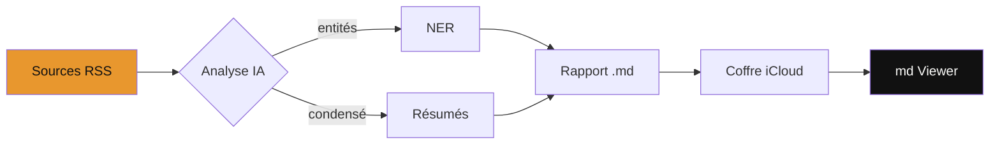
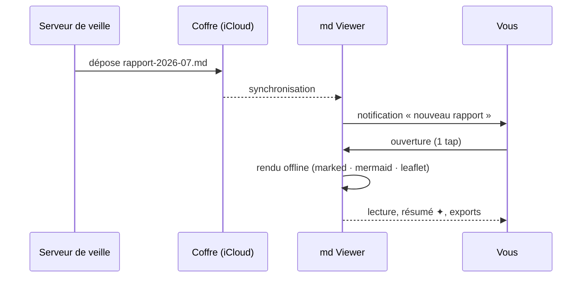
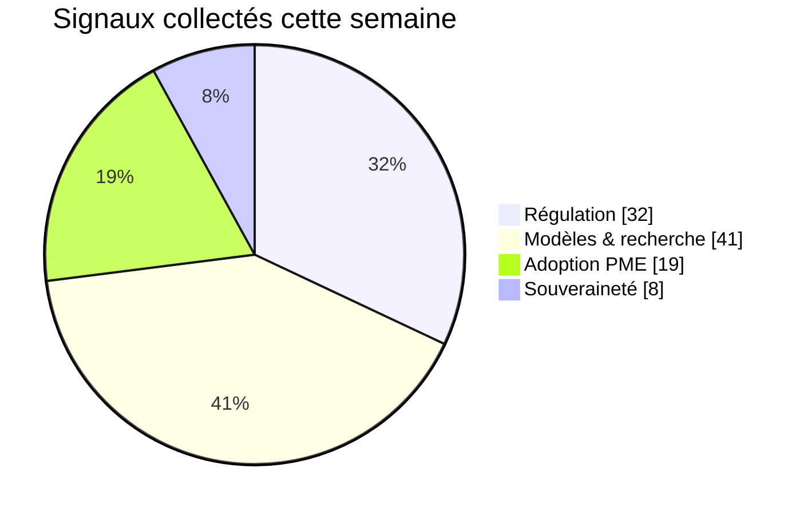
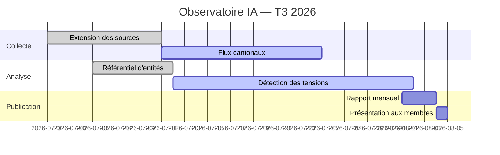
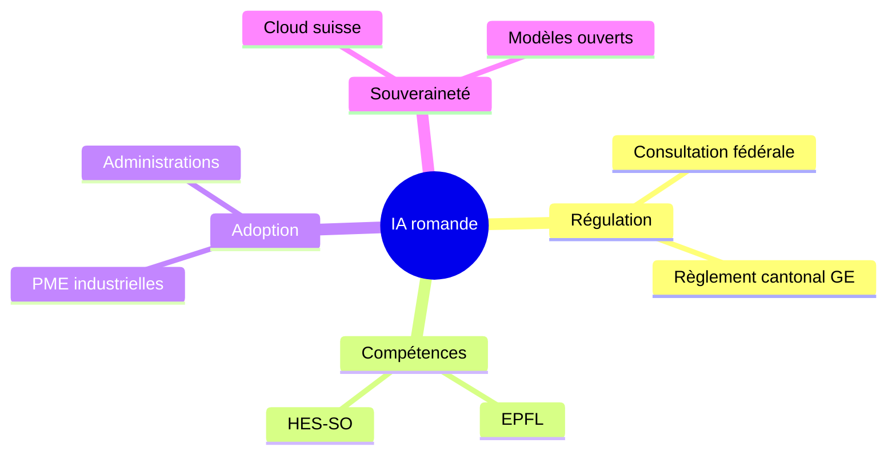

# Observatoire IA — Suisse romande

Ce rapport de démonstration exerce **tout** ce que md Viewer sait afficher :
la typographie de la charte [[OK-ia]], les callouts Obsidian, les *wiki-links*,
la coloration des entités, les tableaux, les listes de tâches, le code, les
**cinq familles de diagrammes Mermaid** et les **cartes Leaflet** interactives —
le tout **100 % hors-ligne**.

> [!tip] Comment explorer ce document
> - Touchez **☰** pour le **sommaire** et sautez de section en section ;
> - touchez **🔍** et cherchez « souveraineté » : les occurrences se surlignent ;
> - touchez un **diagramme** ou une **image** : zoom plein écran vectoriel ;
> - touchez **✦** pour le **résumé Apple Intelligence**, généré sur l'appareil ;
> - touchez **⇪** pour exporter en **PDF** ou en **Word (.docx)** — tableaux éditables.

> [!warning] Envie d'un diaporama ?
> Ce rapport n'a pas de séparateurs `---` : c'est un document de lecture.
> Ouvrez plutôt la [présentation d'exemple](https://ok-ia.ch/mdviewer/exemples/presentation-exemple.md)
> pour le mode Présentation, ses thèmes et ses transitions.

## 1. Synthèse du mois

L'activité IA en Suisse romande s'intensifie : **486 articles** analysés
(+18 %), **12 initiatives cantonales** suivies, et une consultation fédérale
toujours ouverte. Les entités les plus citées restent la [[Confédération suisse]],
l'[[EPFL]] et le [[CERN]], devant [[Apple]] et son écosystème
[[Apple Intelligence]].

> [!note] Méthode
> Les signaux proviennent de flux publics analysés localement. Aucune donnée
> personnelle n'est collectée ; les chiffres de ce rapport d'exemple sont
> illustratifs.

### 1.1 Le pipeline de veille



### 1.2 Qui parle à qui

Le diagramme de **séquence** montre le trajet d'un rapport, de la collecte à
votre écran :



## 2. Signaux et tendances

### 2.1 Répartition thématique



### 2.2 Feuille de route de l'observatoire

Le **Gantt** ci-dessous trace les jalons du trimestre :



### 2.3 Les idées en carte mentale



## 3. Sur le terrain

Les cantons avancent à des rythmes différents. La carte situe les initiatives
suivies ce mois — **pincez, déplacez, ⛶ plein écran** ; seules les tuiles de
fond nécessitent le réseau.

```leaflet
id: exemple-romandie
minZoom: 7
maxZoom: 14
height: 460px
marker: 46.2044, 6.1432, [[Genève]]
marker: 46.5197, 6.6323, [[Lausanne]]
marker: 46.8065, 7.1620, [[Fribourg]]
marker: 46.9930, 6.9319, [[Neuchâtel]]
marker: 46.2331, 7.3606, [[Sion]]
marker: 47.1368, 7.2468, [[Bienne]]
```

> [!info] Syntaxe
> Un bloc de code `leaflet` à la façon du plugin Obsidian : `marker: lat, long, [[Nom]]`,
> avec `minZoom`, `maxZoom` et `height` en options. Cadrage automatique sur les points.

## 4. Chiffres clés

| Indicateur                  | Mai   | Juin  | Juillet | Tendance |
|-----------------------------|-------|-------|---------|----------|
| Articles analysés           | 389   | 412   | 486     | ↗        |
| Entités détectées           | 1 054 | 1 208 | 1 371   | ↗        |
| Initiatives cantonales      | 7     | 9     | 12      | ↗        |
| Consultations fédérales     | 1     | 2     | 2       | →        |
| Rapports publiés            | 4     | 4     | 5       | ↗        |

Les tableaux restent **éditables** dans l'export Word et PowerPoint — essayez :
**⇪ → Exporter en Word (.docx)**, puis ouvrez dans Word ou Pages.

## 5. À suivre

- [x] Consultation fédérale : synthèse des réponses publiée
- [x] Genève : entrée en vigueur du règlement sur les algorithmes publics
- [ ] Lausanne : hackathon « IA & services publics » (28 août)
- [ ] Valais : appel à projets e-santé, décision attendue
- [ ] Rapport spécial « souveraineté numérique » (septembre)

> [!bug] Le callout qui pique
> Même les mauvaises nouvelles sont bien mises en page : le fournisseur du
> flux X a changé son format de date sans prévenir. Correctif déployé.

> [!quote] Entendu en conférence
> « L'enjeu n'est pas d'avoir des modèles suisses, mais de savoir ce que nos
> données deviennent. » — table ronde souveraineté, Lausanne, juillet 2026.

## 6. Sous le capot (pour les curieux)

Un extrait de code avec coloration :

```swift
/// Ouvre un rapport du coffre via son lien mdviewer://
func handleIncoming(_ url: URL) {
    guard url.scheme == "mdviewer" else { return open(url: url) }
    handleScheme(url)   // open?url=… ou render?content=…
}
```

Et le lien profond qui a ouvert ce document, peut-être :
`mdviewer://open?url=https://ok-ia.ch/mdviewer/exemples/rapport-exemple.md`

## Entités

### Organisations
- [[OK-ia]]
- [[Confédération suisse]]
- [[EPFL]]
- [[CERN]]
- [[Apple]]

### Produits
- [[Apple Intelligence]]
- [[fornews.ai]]
- [[TestFlight]]

### Lieux
- [[Genève]]
- [[Lausanne]]
- [[Sion]]

### Personnes
- [[Patrick Ostertag]]

La Confédération suisse consulte, l'EPFL forme, le CERN calcule, et Apple
pousse Apple Intelligence sur l'appareil — pendant que fornews.ai alimente la
veille et que TestFlight distribue les bêtas. Depuis Genève et Lausanne,
Patrick Ostertag et OK-ia suivent le tout… et Sion n'est jamais loin.

*Rapport de démonstration généré pour la page [md Viewer](https://ok-ia.ch/mdviewer/) —
« Ce que les algorithmes ignorent encore. »*
