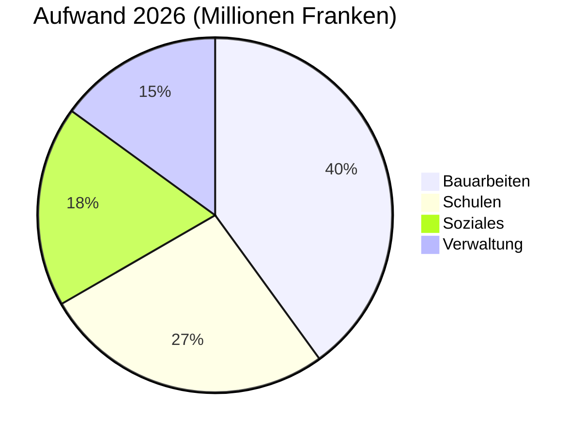

# Jahresbericht 2026

Der Gemeinderat von [[Montagny]] blickt auf das vergangene Jahr zurück: drei Bauprojekte
abgeschlossen, ein Baudenkmal restauriert und das Budget auf 2,3 % genau eingehalten.


## Bauarbeiten

Die Baustelle an der Seestrasse wurde im April abgeschlossen, zwei Monate vor dem beschlossenen
Zeitplan. Sie kostete 1,8 Millionen Franken, 120 000 Franken weniger als der vom Gemeinderat
bewilligte Kredit. Die 1962 verlegte Trinkwasserleitung wurde auf 900 Metern ersetzt.

Das Schulhaus Fontaine wurde im Sommer gedämmt: Der Heizverbrauch dürfte ab dem nächsten Winter
um 35 % sinken. Die Schülerinnen und Schüler kehrten wie geplant zum Schulbeginn im August in
ihre Klassenzimmer zurück.

Die öffentliche Beleuchtung ist nun vollständig auf LED umgestellt: 412 Leuchten ersetzt, mit
einer Teilabschaltung zwischen 1 und 5 Uhr morgens, beschlossen nach Anhörung der Quartiere.


## Kulturerbe

Die Kapelle Saint-Jean hat nach achtzehn Monaten Restaurierung ihre Fresken aus dem
15. Jahrhundert zurückerhalten. Die Führungen beginnen im Frühling wieder, jeweils am ersten
Sonntag des Monats.


## Finanzen

Die Rechnung 2026 schliesst mit 6 Millionen Franken Aufwand, 2,3 % neben dem Budget. Die
Bauarbeiten machen den grössten Anteil aus, vor den Schulen.



## Gemeindegebiet

Die drei Baustellen liegen südlich des Dorfes.

```leaflet
lat: 46.79
long: 6.83
zoom: 13
marker: 46.792, 6.831, Seestrasse
marker: 46.787, 6.826, [[Schulhaus Fontaine]]
marker: 46.795, 6.836, Kapelle Saint-Jean
height: 380px
```

## Ausblick

Der Gemeinderat setzt die energetische Sanierung der Gemeindegebäude fort. Das Budget 2027 sieht
einen Aufwandüberschuss von 240 000 Franken vor, gedeckt durch das Gemeindevermögen, und im
Frühling findet eine öffentliche Vernehmlassung zur sanften Mobilität statt.


