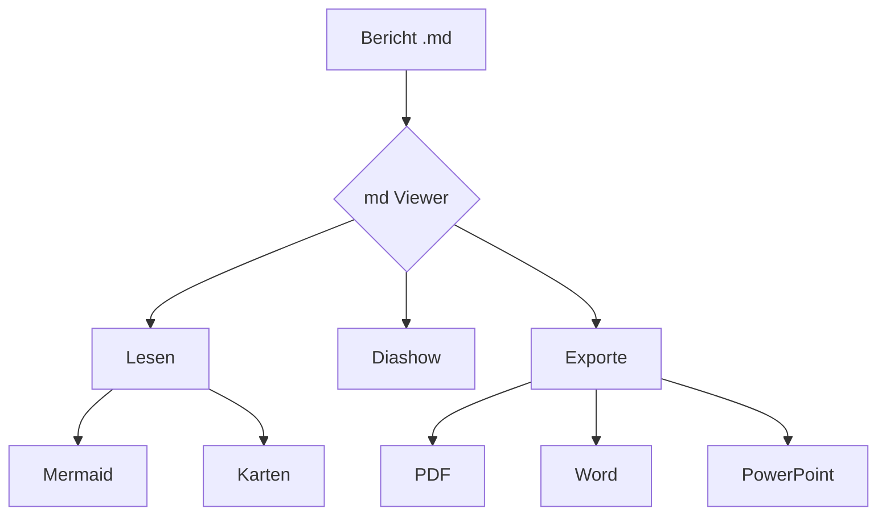

# Mermaid-Diagramme

Fünf Familien, offline dargestellt, im OK-ia-Design — zum Vergrößern antippen.

```mermaid
flowchart TD
    A[Bericht .md] --> B{md Viewer}
    B --> C[Lesen]
    B --> D[Diashow]
    B --> E[Exporte]
    C --> F[Mermaid]
    C --> G[Karten]
    E --> H[PDF]
    E --> I[Word]
    E --> J[PowerPoint]
```

Der Vollbild-Zoom behält die Vektorgrafik: Diagramme bleiben in jeder Größe scharf.
