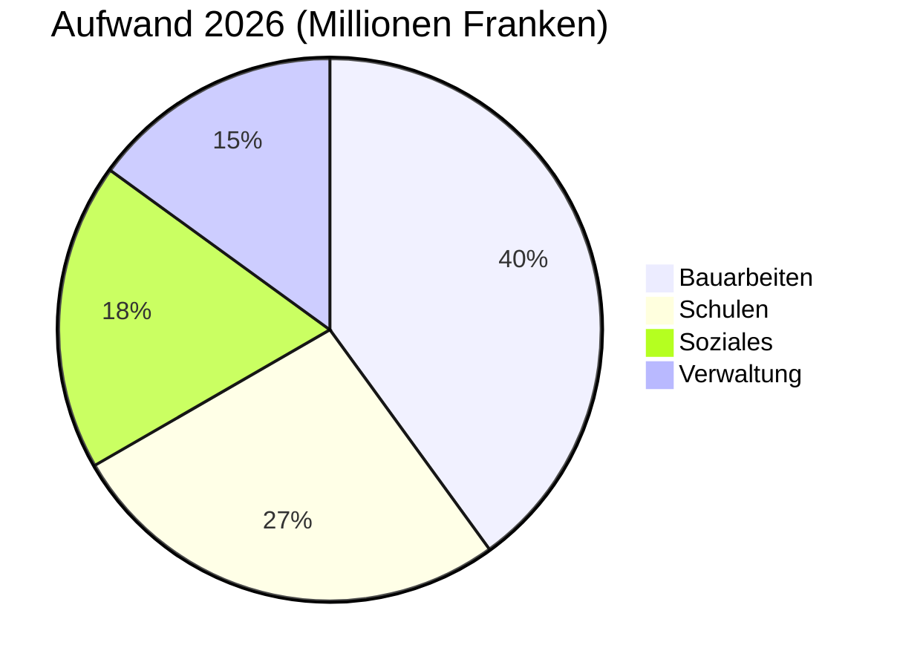

# Jahresbericht 2026

Der Gemeinderat von Montagny fasst das vergangene Jahr zusammen.


---

## Gliederung

1. Bauarbeiten
2. Kulturerbe
3. Finanzen
4. Gemeindegebiet
5. Ausblick

---

## Bauarbeiten

- Baustelle Seestrasse im April abgeschlossen.
- 1,8 Millionen Franken Kosten.
- Trinkwasserleitung auf 900 Metern ersetzt.
- 1962 verlegte Leitung ersetzt


---

## Beleuchtung

- Öffentliche Beleuchtung vollständig auf LED umgestellt.
- 412 Leuchten ersetzt.
- Teilabschaltung zwischen 1 und 5 Uhr morgens.
- Beschlossen nach Anhörung der Quartiere.


---

## Kulturerbe

- Kapelle Saint-Jean restauriert nach achtzehn Monaten.
- Fresken aus dem 15. Jahrhundert zurückerhalten.
- Führungen beginnen im Frühling wieder.
- Jeder erste Sonntag im Monat.
- Die Restaurierung ist abgeschlossen.


---

## Finanzen

- Rechnung 2026 schließt mit 6 Millionen Franken Aufwand.
- 2,3 % neben dem Budget.
- Bauarbeiten machen den grössten Anteil aus.
- vor den Schulen.

---

## Finanzen



---

## Gemeindegebiet

```leaflet
lat: 46.79
long: 6.83
zoom: 13
marker: 46.792, 6.831, Seestrasse
marker: 46.787, 6.826, [[Schulhaus Fontaine]]
marker: 46.795, 6.836, Kapelle Saint-Jean
height: 380px
```

---

## Ausblick

- Gemeinderat setzt energetische Sanierung fort.
- Budget 2027: Aufwandüberschuss von 240 000 Franken.
- Gedeckt durch Gemeindevermögen.
- Frühling: öffentliche Vernehmlassung zur sanften Mobilität.
- Einzige öffentliche Anhörung geplant.


---

## Das Wichtigste

- Kapelle Saint-Jean restauriert nach achtzehn Monaten.
- Rechnung 2026 schließt mit 6 Millionen Franken Aufwand.
- Gemeinderat setzt energetische Sanierung fort.
