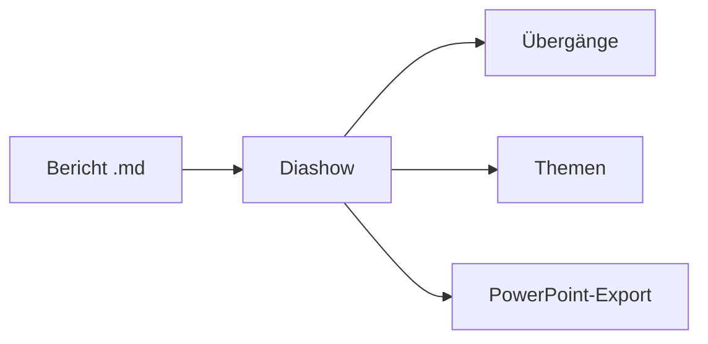

# md Viewer

## Ihre Markdown-Berichte, präsentiert

Ein Dokument wird zur Vollbild-Diashow: geteilt an `---`, fünf Übergänge,
eine Miniaturübersicht, fünf Farbthemen.

---

## Diagramme in Folien



---

## Karten in Folien

```leaflet
id: diapo-romandie
minZoom: 7
maxZoom: 12
height: 420px
marker: 46.2044, 6.1432, [[Genf]]
marker: 46.5197, 6.6323, [[Lausanne]]
marker: 46.9930, 6.9319, [[Neuenburg]]
```
