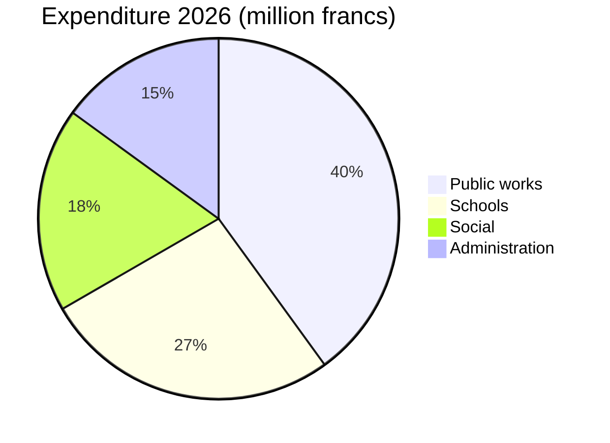

# Annual Report 2026

The Municipality of [[Montagny]] looks back on the past year: three building projects completed,
a heritage site restored and a budget kept within 2.3%.


## Public works

The Lake Road project was completed in April, two months ahead of the approved schedule. It cost
1.8 million francs, 120,000 francs less than the credit granted by the Town Council. The drinking
water main, laid in 1962, was replaced over 900 metres.

The Fontaine school was insulated over the summer: heating consumption should fall by 35% from
next winter. Pupils returned to their classrooms at the start of the August term, as planned.

Street lighting is now entirely LED: 412 lights replaced, with partial switch-off between 1 and
5 a.m., decided after consulting the neighbourhoods.


## Heritage

The Saint-Jean chapel has recovered its 15th-century frescoes after eighteen months of
restoration. Guided tours will resume in spring, on the first Sunday of every month.


## Finances

The 2026 accounts close at 6 million francs of expenditure, within 2.3% of the approved budget.
Public works account for the largest share, ahead of schools.



## Area

All three projects are located south of the village.

```leaflet
lat: 46.79
long: 6.83
zoom: 13
marker: 46.792, 6.831, Lake Road
marker: 46.787, 6.826, [[Fontaine school]]
marker: 46.795, 6.836, Saint-Jean chapel
height: 380px
```

## Outlook

The Municipality will continue the energy retrofit of public buildings. The 2027 budget forecasts
a deficit of 240,000 francs, covered by municipal reserves, and a public consultation on active
mobility will take place in spring.


