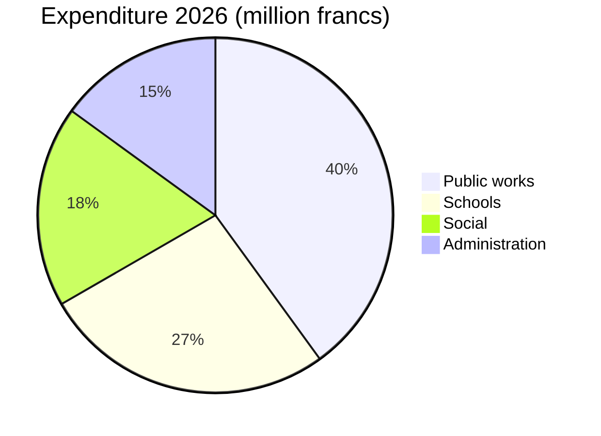

# Annual Report 2026

Montagny reviews past year with completed building projects and restored heritage site.


---

## Outline

1. Public works
2. Heritage
3. Finances
4. Area
5. Outlook

---

## Lake Road project

- Completed in April
- Two months ahead
- Cost 1.8 million francs
- 120,000 francs less credit
- Water main replaced over 900 metres


---

## Fontaine school

- Insulated over summer
- Heating consumption should fall
- By 35% from next winter
- Pupils returned at start
- August term as planned


---

## Heritage

- Saint-Jean chapel recovered 15th-century frescoes
- After eighteen months of restoration
- Guided tours resume in spring
- On first Sunday of every month


---

## Finances

- 2026 accounts close at 6 million francs
- within 2.3% of approved budget
- Public works account for largest share
- ahead of schools

---

## Finances



---

## Area

```leaflet
lat: 46.79
long: 6.83
zoom: 13
marker: 46.792, 6.831, Lake Road
marker: 46.787, 6.826, [[Fontaine school]]
marker: 46.795, 6.836, Saint-Jean chapel
height: 380px
```

---

## Outlook

- Energy retrofit continues in public buildings.
- 2027 budget forecasts deficit of 240,000 francs.
- Deficit covered by municipal reserves.
- Public consultation on active mobility in spring.
- Municipality will continue retrofit effort.


---

## Key takeaways

- Lake Road project completed in April, two months ahead.
- Fontaine school insulated over summer, heating should fall by 35%.
- Heritage chapel recovered frescoes after eighteen months, tours resume in spring.
