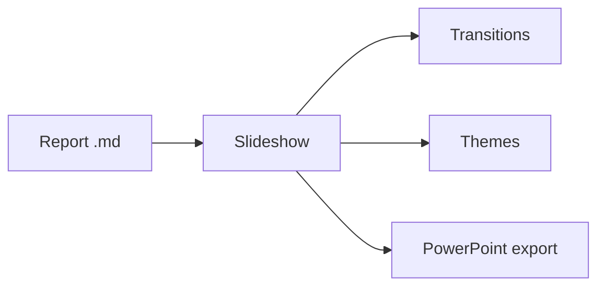

# md Viewer

## Your Markdown reports, presented

A document becomes a full-screen slideshow: split on `---`, five transitions,
a thumbnail browser, five colour themes.

---

## Diagrams inside slides



---

## Maps inside slides

```leaflet
id: diapo-romandie
minZoom: 7
maxZoom: 12
height: 420px
marker: 46.2044, 6.1432, [[Genève]]
marker: 46.5197, 6.6323, [[Lausanne]]
marker: 46.9930, 6.9319, [[Neuchâtel]]
```
