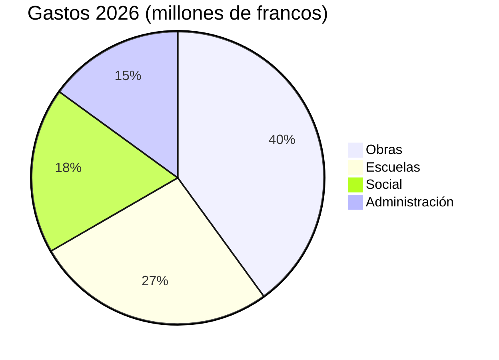

# Informe anual 2026

El Ayuntamiento de [[Montagny]] presenta el año transcurrido: tres obras terminadas, un
patrimonio restaurado y un presupuesto cumplido con un margen del 2,3 %.


## Obras

La obra de la carretera del Lago terminó en abril, dos meses antes del calendario aprobado.
Costó 1,8 millones de francos, 120 000 francos menos que el crédito concedido por el Consejo
municipal. La conducción de agua potable, instalada en 1962, se sustituyó en 900 metros.

El colegio de la Fontaine se aisló durante el verano: el consumo de calefacción debería bajar un
35 % a partir del próximo invierno. Los alumnos volvieron a sus aulas al inicio del curso en
agosto, como estaba previsto.

El alumbrado público es ya totalmente LED: 412 puntos de luz sustituidos y un apagado parcial
entre la 1 y las 5 de la madrugada, decidido tras consultar a los barrios.


## Patrimonio

La capilla de Saint-Jean ha recuperado sus frescos del siglo XV tras dieciocho meses de
restauración. Las visitas guiadas se reanudarán en primavera, el primer domingo de cada mes.


## Finanzas

Las cuentas de 2026 cierran con 6 millones de francos de gastos, a un 2,3 % del presupuesto
aprobado. Las obras representan la mayor parte, por delante de las escuelas.



## Territorio

Las tres obras se encuentran al sur del pueblo.

```leaflet
lat: 46.79
long: 6.83
zoom: 13
marker: 46.792, 6.831, Carretera del Lago
marker: 46.787, 6.826, [[Colegio de la Fontaine]]
marker: 46.795, 6.836, Capilla de Saint-Jean
height: 380px
```

## Perspectivas

El Ayuntamiento proseguirá la rehabilitación energética de los edificios municipales. El
presupuesto de 2027 prevé un déficit de 240 000 francos, cubierto por el patrimonio municipal, y
en primavera se celebrará una consulta pública sobre movilidad sostenible.


