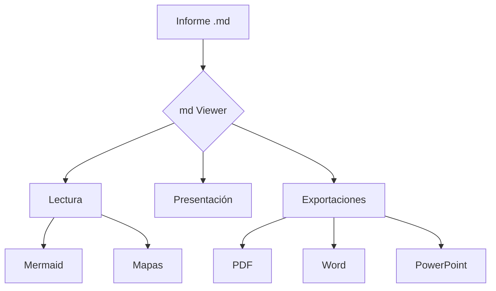

# Diagramas Mermaid

Cinco familias representadas sin conexión, con el tema OK-ia: toque para ampliar.

El zoom a pantalla completa conserva el dibujo vectorial: los diagramas siguen nítidos a cualquier escala.
