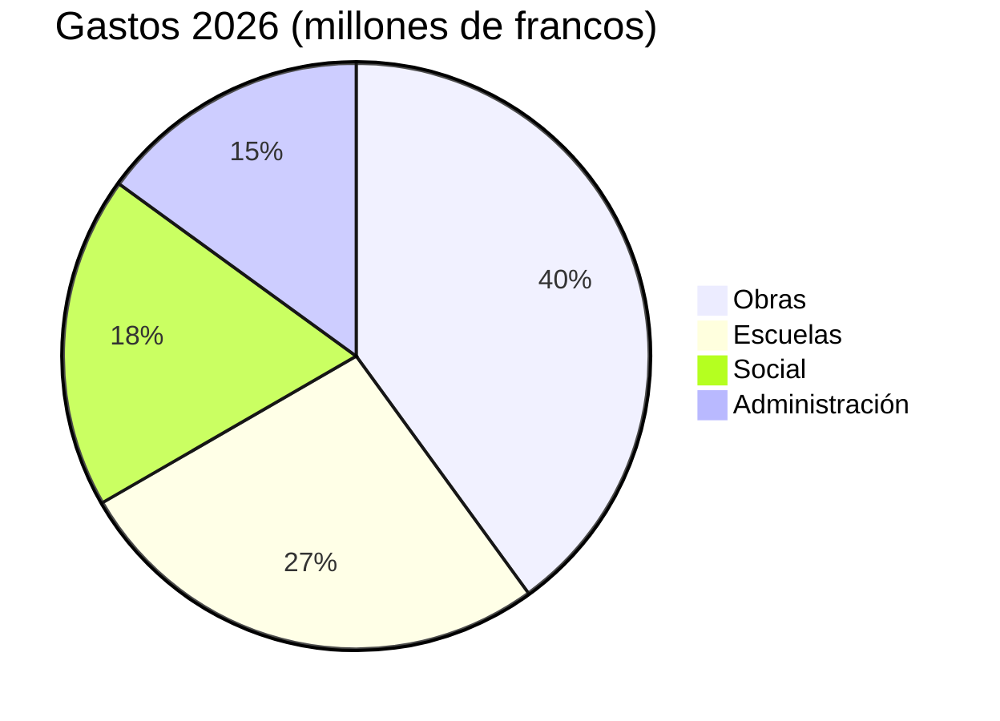

# Informe anual 2026

El Ayuntamiento de Montagny presenta el año transcurrido.


---

## Índice

1. Obras
2. Patrimonio
3. Finanzas
4. Territorio
5. Perspectivas

---

## Obras

- La obra de la carretera del Lago terminó en abril.
- Costó 1,8 millones de francos.
- Se sustituyó la conducción de agua potable en 900 metros.
- El colegio de la Fontaine se aisló durante el verano.
- El alumbrado público es ya totalmente LED.


---

## Obras

- El consumo de calefacción debería bajar un 35 %.
- Los alumnos volvieron a sus aulas al inicio del curso en agosto.
- 412 puntos de luz sustituidos.
- Un apagado parcial entre la 1 y las 5 de la madrugada.
- Decidido tras consultar a los barrios.


---

## Patrimonio

- Capilla de Saint-Jean recupera frescos del siglo XV
- Restauración de dieciocho meses
- Visitas guiadas en primavera
- Primer domingo de cada mes
- Reanudación de visitas


---

## Finanzas

- Cuentas de 2026 cierran con 6 millones de francos de gastos
- a un 2,3 % del presupuesto aprobado
- Obras representan la mayor parte
- por delante de las escuelas

---

## Finanzas



---

## Territorio

```leaflet
lat: 46.79
long: 6.83
zoom: 13
marker: 46.792, 6.831, Carretera del Lago
marker: 46.787, 6.826, [[Colegio de la Fontaine]]
marker: 46.795, 6.836, Capilla de Saint-Jean
height: 380px
```

---

## Perspectivas

- Ayuntamiento proseguirá rehabilitación energética
- Presupuesto 2027 prevé déficit de 240 000 francos
- Patrimoine municipal cubre déficit
- Consulta pública primavera sobre movilidad sostenible


---

## Para recordar

- La obra de la carretera del Lago terminó en abril. Costó 1,8 millones de francos.
- El consumo de calefacción debería bajar un 35 %. Los alumnos volvieron a sus aulas al inicio del curso en agosto.
- Capilla de Saint-Jean recupera frescos del siglo XV. Restauración de dieciocho meses.
