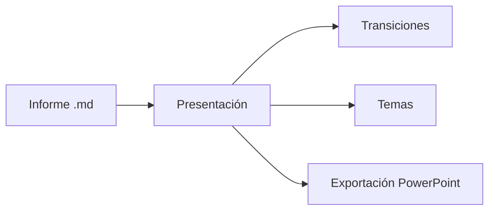

# md Viewer

## Sus informes Markdown, presentados

Un documento se convierte en una presentación a pantalla completa: dividido en `---`, cinco transiciones,
un visor de miniaturas, cinco temas de color.

---

## Diagramas en las diapositivas



---

## Mapas en las diapositivas

```leaflet
id: diapo-romandie
minZoom: 7
maxZoom: 12
height: 420px
marker: 46.2044, 6.1432, [[Ginebra]]
marker: 46.5197, 6.6323, [[Lausana]]
marker: 46.9930, 6.9319, [[Neuchâtel]]
```
