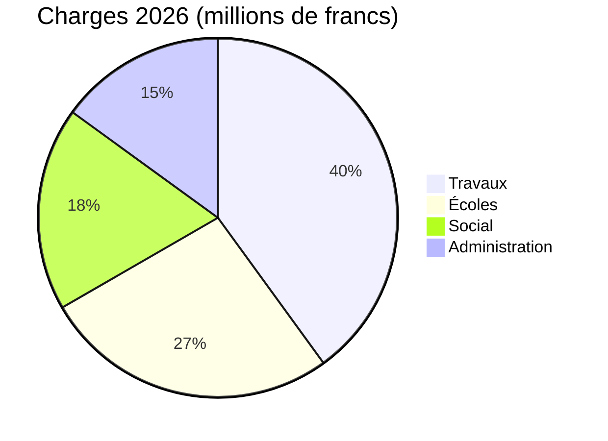

# Rapport d'activité 2026

La Municipalité de [[Montagny]] présente l'année écoulée : trois chantiers achevés, un
patrimoine restauré et un budget tenu à 2,3 % près.


## Travaux

Le chantier de la route du Lac s'est achevé en avril, avec deux mois d'avance sur le calendrier
voté. Il a coûté 1,8 million de francs, soit 120 000 francs de moins que le crédit accordé par le
Conseil communal. La conduite d'eau potable, posée en 1962, a été remplacée sur 900 mètres.

Le collège de la Fontaine a été isolé durant l'été : la consommation de chauffage devrait baisser
de 35 % dès l'hiver prochain. Les élèves ont retrouvé leurs classes à la rentrée d'août, comme
prévu.

L'éclairage public est désormais entièrement en LED : 412 points lumineux remplacés, et une
extinction partielle entre 1 heure et 5 heures du matin, décidée après consultation des quartiers.


## Patrimoine

La chapelle Saint-Jean a retrouvé ses fresques du XVe siècle, après dix-huit mois de
restauration. Les visites guidées reprendront au printemps, le premier dimanche de chaque mois.


## Finances

Les comptes 2026 bouclent sur 6 millions de francs de charges, à 2,3 % du budget voté. Les
travaux en représentent la plus grande part, devant les écoles.



## Territoire

Les trois chantiers se trouvent au sud du village.

```leaflet
lat: 46.79
long: 6.83
zoom: 13
marker: 46.792, 6.831, Route du Lac
marker: 46.787, 6.826, [[Collège de la Fontaine]]
marker: 46.795, 6.836, Chapelle Saint-Jean
height: 380px
```

## Perspectives

La Municipalité poursuivra l'assainissement énergétique des bâtiments communaux. Le budget 2027
prévoit un excédent de charges de 240 000 francs, couvert par la fortune communale, et une
consultation publique sur la mobilité douce aura lieu au printemps.


