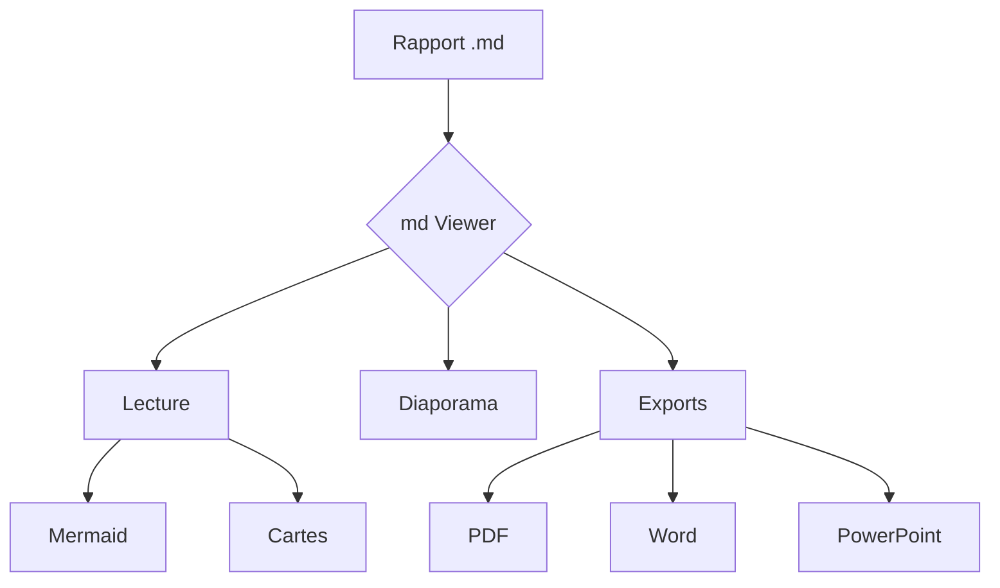

# Diagrammes Mermaid

Cinq familles rendues hors-ligne, au thème OK-ia — touchez pour agrandir.

```mermaid
flowchart TD
    A[Rapport .md] --> B{md Viewer}
    B --> C[Lecture]
    B --> D[Diaporama]
    B --> E[Exports]
    C --> F[Mermaid]
    C --> G[Cartes]
    E --> H[PDF]
    E --> I[Word]
    E --> J[PowerPoint]
```

Le zoom plein écran garde le tracé vectoriel : les diagrammes restent nets à toute échelle.
