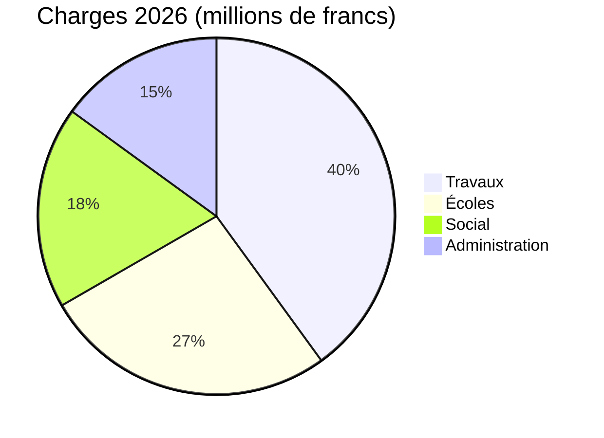

# Rapport d'activité 2026

La Municipalité de [[Montagny]] présente ses réalisations de l'année écoulée.


---

## Plan

1. Travaux
2. Patrimoine
3. Finances
4. Territoire
5. Perspectives

---

## Travaux – Route du Lac

- Chantier terminé en avril
- Deux mois d'avance sur calendrier
- Coût : 1,8 million de francs
- 120 000 francs de moins crédit
- Remplacement conduite d'eau sur 900 mètres


---

## Travaux – Éclairage et collège

- Éclairage entièrement LED
- 412 points lumineux remplacés
- Extinction partielle entre 1h et 5h
- Consommation chauffage baisse de 35%
- Classes retrouvées à rentrée d'août


---

## Patrimoine

- Chapelle Saint-Jean : fresques du XVe siècle
- Restauration : dix-huit mois
- Visites guidées : au printemps
- Premier dimanche de chaque mois
- Reprise prévue


---

## Finances

- Comptes 2026 bouclent sur 6 millions de francs de charges
- À 2,3 % du budget voté
- Les travaux en représentent la plus grande part
- Devant les écoles

---

## Finances



---

## Territoire

```leaflet
lat: 46.79
long: 6.83
zoom: 13
marker: 46.792, 6.831, Route du Lac
marker: 46.787, 6.826, [[Collège de la Fontaine]]
marker: 46.795, 6.836, Chapelle Saint-Jean
height: 380px
```

---

## Perspectives

- Assainissement énergétique des bâtiments communaux
- Excédent de charges de 240 000 francs
- Couvert par la fortune communale
- Consultation publique sur la mobilité douce
- Au printemps


---

## À retenir

- Travaux – Route du Lac : chantier terminé avec deux mois d'avance.
- Travaux – Éclairage et collège : 412 points lumineux remplacés.
- Patrimoine : restauration de la chapelle Saint-Jean sur dix-huit mois.
