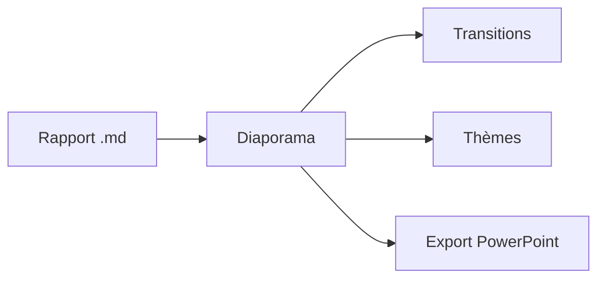

# md Viewer

## Vos rapports Markdown, présentés

Un document devient un diaporama plein écran : découpe sur `---`, cinq transitions,
navigateur de vignettes, cinq thèmes de couleurs.

---

## Diagrammes dans les diapositives



---

## Cartes dans les diapositives

```leaflet
id: diapo-romandie
minZoom: 7
maxZoom: 12
height: 420px
marker: 46.2044, 6.1432, [[Genève]]
marker: 46.5197, 6.6323, [[Lausanne]]
marker: 46.9930, 6.9319, [[Neuchâtel]]
```
