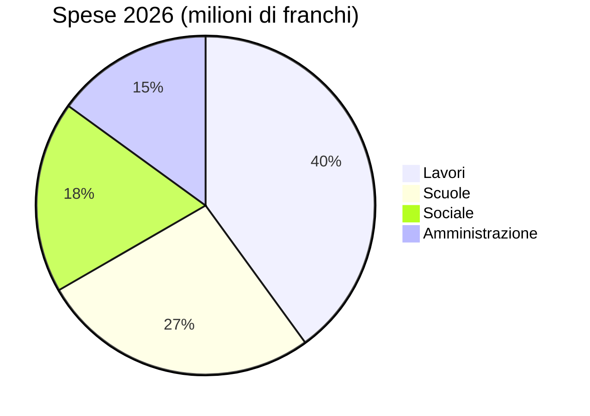

# Rapporto annuale 2026

Il Municipio di [[Montagny]] presenta l'anno trascorso: tre cantieri conclusi, un patrimonio
restaurato e un preventivo rispettato al 2,3 %.


## Lavori

Il cantiere della strada del Lago si è concluso in aprile, con due mesi di anticipo sul
calendario approvato. È costato 1,8 milioni di franchi, 120 000 franchi in meno del credito
concesso dal Consiglio comunale. La condotta dell'acqua potabile, posata nel 1962, è stata
sostituita su 900 metri.

La scuola della Fontaine è stata isolata durante l'estate: il consumo di riscaldamento dovrebbe
calare del 35 % dal prossimo inverno. Gli allievi sono tornati nelle loro aule all'inizio
dell'anno scolastico in agosto, come previsto.

L'illuminazione pubblica è ora interamente a LED: 412 punti luce sostituiti e uno spegnimento
parziale tra l'una e le cinque del mattino, deciso dopo aver consultato i quartieri.


## Patrimonio

La cappella di Saint-Jean ha ritrovato i suoi affreschi del XV secolo, dopo diciotto mesi di
restauro. Le visite guidate riprenderanno in primavera, la prima domenica di ogni mese.


## Finanze

I conti 2026 chiudono con 6 milioni di franchi di spese, al 2,3 % dal preventivo approvato. I
lavori ne rappresentano la parte maggiore, davanti alle scuole.



## Territorio

I tre cantieri si trovano a sud del paese.

```leaflet
lat: 46.79
long: 6.83
zoom: 13
marker: 46.792, 6.831, Strada del Lago
marker: 46.787, 6.826, [[Scuola della Fontaine]]
marker: 46.795, 6.836, Cappella di Saint-Jean
height: 380px
```

## Prospettive

Il Municipio proseguirà il risanamento energetico degli edifici comunali. Il preventivo 2027
prevede un disavanzo di 240 000 franchi, coperto dal patrimonio comunale, e in primavera si terrà
una consultazione pubblica sulla mobilità lenta.


