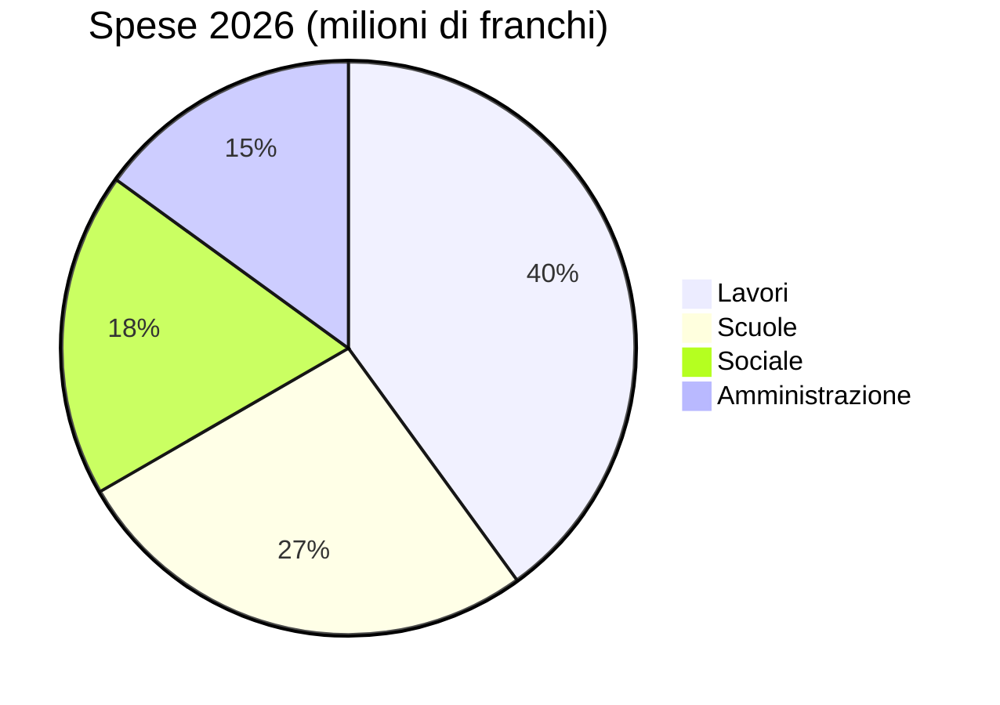

# Rapporto annuale 2026

Il Municipio di Montagny presenta l'anno trascorso.


---

## Indice

1. Lavori
2. Patrimonio
3. Finanze
4. Territorio
5. Prospettive

---

## Lavori

- Cantiere strada Lago concluso in aprile.
- Costo: 1,8 milioni franchi.
- Condotta acqua sostituita su 900 metri.


---

## Lavori

- Illuminazione pubblica ora a LED.
- 412 punti luce sostituiti.
- Uno spegnimento parziale tra l'una e le cinque.
- Deciso dopo consultare i quartieri.


---

## Patrimonio

- Affreschi di Saint-Jean ritrovati
- Restauro di diciotto mesi
- Visite guidate in primavera
- Prima domenica di ogni mese


---

## Finanze

- I conti 2026 chiudono con 6 milioni di franchi di spese.
- al 2,3 % dal preventivo approvato.
- I lavori ne rappresentano la parte maggiore.
- davanti alle scuole.

---

## Finanze



---

## Territorio

```leaflet
lat: 46.79
long: 6.83
zoom: 13
marker: 46.792, 6.831, Strada del Lago
marker: 46.787, 6.826, [[Scuola della Fontaine]]
marker: 46.795, 6.836, Cappella di Saint-Jean
height: 380px
```

---

## Prospettive

- Municipio proseguirà risanamento energetico edifici comunali
- Preventivo 2027 prevede disavanzo 240 000 franchi
- Coperto patrimonio comunale
- Consultazione pubblica in primavera
- Mobilità lenta


---

## Da ricordare

- Cantiere strada Lago concluso in aprile. Costo: 1,8 milioni franchi. Condotta acqua sostituita su 900 metri.
- Illuminazione pubblica ora a LED. 412 punti luce sostituiti. Uno spegnimento parziale tra l'una e le cinque. Deciso dopo consultare i quartieri.
- Affreschi di Saint-Jean ritrovati. Restauro di diciotto mesi. Visite guidate in primavera. Prima domenica di ogni mese
