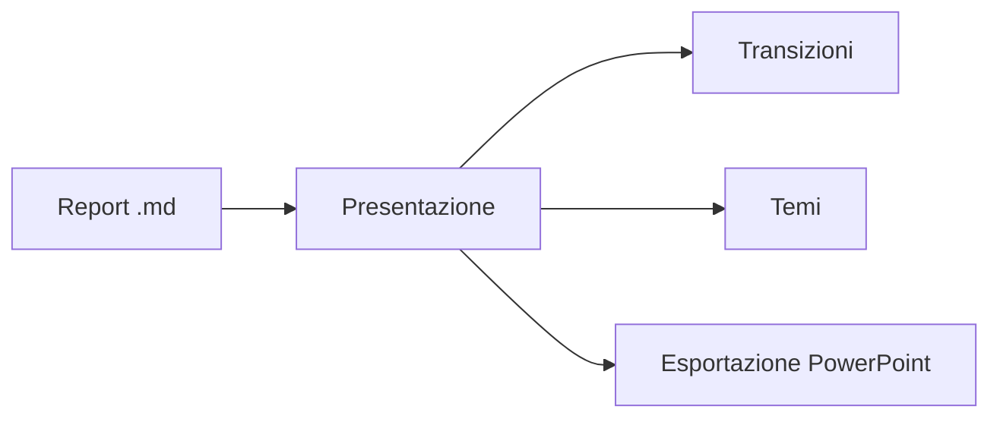

# md Viewer

## I tuoi report Markdown, presentati

Un documento diventa una presentazione a schermo intero: diviso su `---`, cinque transizioni,
un visualizzatore di miniature, cinque temi di colore.

---

## Diagrammi nelle diapositive



---

## Mappe nelle diapositive

```leaflet
id: diapo-romandie
minZoom: 7
maxZoom: 12
height: 420px
marker: 46.2044, 6.1432, [[Ginevra]]
marker: 46.5197, 6.6323, [[Losanna]]
marker: 46.9930, 6.9319, [[Neuchâtel]]
```
