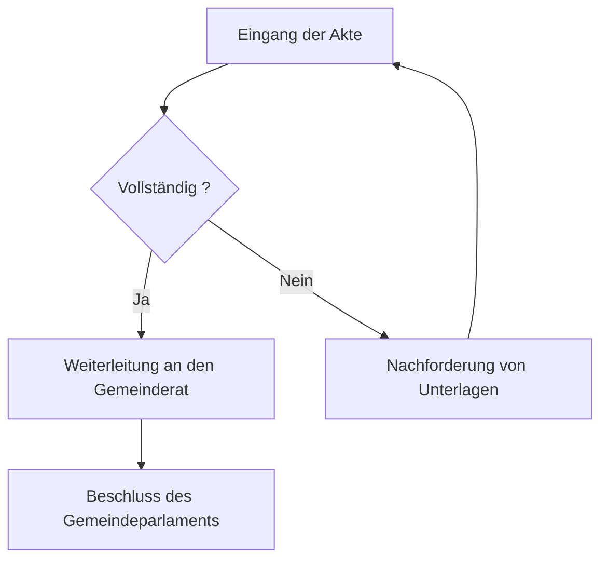

# Jahresbericht 2026

Der Gemeinderat von [[Köniz]] hat die Jahresrechnung vor dem 30. Juni genehmigt, wie es das
Gemeindegesetz vorschreibt. Die Geschäftsprüfungskommission ist im vergangenen Geschäftsjahr
siebenmal zusammengetreten und hat jeden Kredit über hunderttausend Franken geprüft.

> [!info] Testdokument
> Dieser Bericht dient der Prüfung der automatischen Übersetzung: er enthält absichtlich
> Code, Diagramme, eine Karte und Verweise, die nicht übersetzt werden dürfen.

## Rechnung

Der Betriebsaufwand beläuft sich auf 4,2 Millionen Franken und liegt damit 3,1 Prozent über
dem Vorjahr. Diese Zunahme erklärt sich durch die Teuerungsanpassung der Löhne und durch die
Inbetriebnahme des Fernwärmenetzes im Quartier [[Liebefeld]].

| Position | Betrag | Abweichung |
| --- | --- | --- |
| Betriebsaufwand | 4,2 Millionen | +3,1 % |
| Steuererträge | 4,0 Millionen | −1,8 % |
| Abschreibungen | 620 000 | unverändert |

Der Verschuldungsgrad bleibt tragbar. Für die Berechnung wird vor jedem Export die Funktion
`berechneTotal()` aufgerufen, und die Werte werden vollständig auf
[der Gemeindeseite](https://ok-ia.ch/bericht.html) veröffentlicht.

### Abgeschlossene Arbeiten

- Erneuerung des Abwasserkanals an der Schwarzenburgstrasse
- Energetische Sanierung des Mehrzweckraums
- Ersatz der öffentlichen Beleuchtung durch Leuchtdioden
- [ ] Prüfung der Rechnung vor dem 30. Juni
- [x] Weiterleitung an das Gemeindeparlament

```python
def berechne_total(posten):
    """Summiert die Aufwandposten und gibt das Total zurück."""
    return sum(p.betrag for p in posten if p.gueltig)
```

## Verfahren

Das Dossier durchläuft das unten stehende Verfahren, unverändert seit 2024.



## Gebiet

Die drei Baustellen liegen im südlichen Gemeindegebiet.

```leaflet
lat: 46.9240
long: 7.4140
zoom: 13
marker: 46.9256, 7.4181, [[Mehrzweckraum]]
marker: 46.9198, 7.4092, Abwasserkanal Schwarzenburgstrasse
marker: 46.9287, 7.4225, Öffentliche Beleuchtung
height: 380px
```

## Ausblick

Der Gemeinderat will die Sanierung des Gebäudebestands fortsetzen und die Studie für eine neue
Erschliessung mit dem öffentlichen Verkehr zum Bezirkshauptort in Auftrag geben. Im Frühling
wird eine öffentliche Mitwirkung durchgeführt, und das Budget 2027 sieht einen Aufwandüberschuss
von 180 000 Franken vor, der aus dem Eigenkapital gedeckt werden kann.

Der vollständige Text ist ohne Anmeldung unter https://ok-ia.ch/koeniz/2026 abrufbar.

## Entitäten

### Organisationen

- [[Gemeinderat Köniz]]
- [[Gemeindeparlament]]

### Orte

- [[Köniz]]
- [[Liebefeld]]
- [[Mehrzweckraum]]
