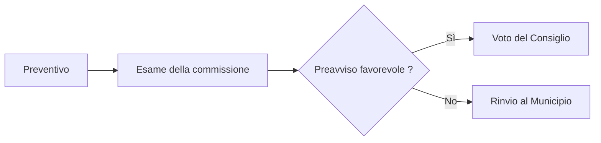

# Conti 2026

Presentazione al Consiglio comunale di [[Losone]]

---

## L'essenziale in tre cifre

- **4,2 milioni** di spese correnti
- **4,0 milioni** di entrate fiscali
- **180 000 franchi** di eccedenza prevista per il 2027

---

## Evoluzione delle spese

Le spese di gestione corrente aumentano del 3,1 per cento rispetto all'esercizio precedente.
L'indicizzazione degli stipendi ne spiega la metà, il teleriscaldamento l'altra metà.

| Voce | 2025 | 2026 |
| --- | --- | --- |
| Spese correnti | 4,07 milioni | 4,20 milioni |
| Entrate fiscali | 4,07 milioni | 4,00 milioni |

---

## La procedura di approvazione



---

## I tre cantieri

```leaflet
lat: 46.1700
long: 8.7500
zoom: 13
marker: 46.1712, 8.7534, [[Sala multiuso]]
marker: 46.1668, 8.7489, Collettore di via Vignascia
height: 420px
```

---

## Prospettive

Il Municipio propone di proseguire il risanamento del patrimonio edilizio e di avviare lo
studio di un nuovo collegamento con i trasporti pubblici.

La consultazione pubblica si terrà in primavera. Il calcolo dettagliato usa la funzione
`calcolaTotale()` ed è pubblicato su [il sito comunale](https://ok-ia.ch/rapporto.html).

---

# Grazie

Domande al Municipio di [[Losone]] entro il 30 aprile.
