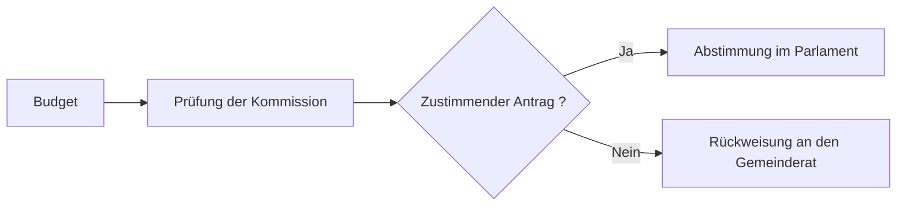

# Rechnung 2026

Präsentation vor dem Gemeindeparlament von [[Köniz]]

---

## Das Wichtigste in drei Zahlen

- **4,2 Millionen** Betriebsaufwand
- **4,0 Millionen** Steuererträge
- **180 000 Franken** erwarteter Aufwandüberschuss für 2027

---

## Entwicklung des Aufwands

Der Betriebsaufwand steigt gegenüber dem Vorjahr um 3,1 Prozent. Die Hälfte davon erklärt die
Teuerungsanpassung der Löhne, die andere Hälfte das Fernwärmenetz.

| Position | 2025 | 2026 |
| --- | --- | --- |
| Betriebsaufwand | 4,07 Millionen | 4,20 Millionen |
| Steuererträge | 4,07 Millionen | 4,00 Millionen |

---

## Der Genehmigungsweg



---

## Die drei Baustellen

```leaflet
lat: 46.9240
long: 7.4140
zoom: 13
marker: 46.9256, 7.4181, [[Mehrzweckraum]]
marker: 46.9198, 7.4092, Abwasserkanal Schwarzenburgstrasse
height: 420px
```

---

## Ausblick

Der Gemeinderat beantragt, die Sanierung des Gebäudebestands fortzusetzen und die Studie für
eine neue Erschliessung mit dem öffentlichen Verkehr in Auftrag zu geben.

Die öffentliche Mitwirkung findet im Frühling statt. Die detaillierte Berechnung verwendet die
Funktion `berechneTotal()` und ist auf [der Gemeindeseite](https://ok-ia.ch/bericht.html)
veröffentlicht.

---

# Danke

Fragen an den Gemeinderat [[Köniz]] bis zum 30. April.
