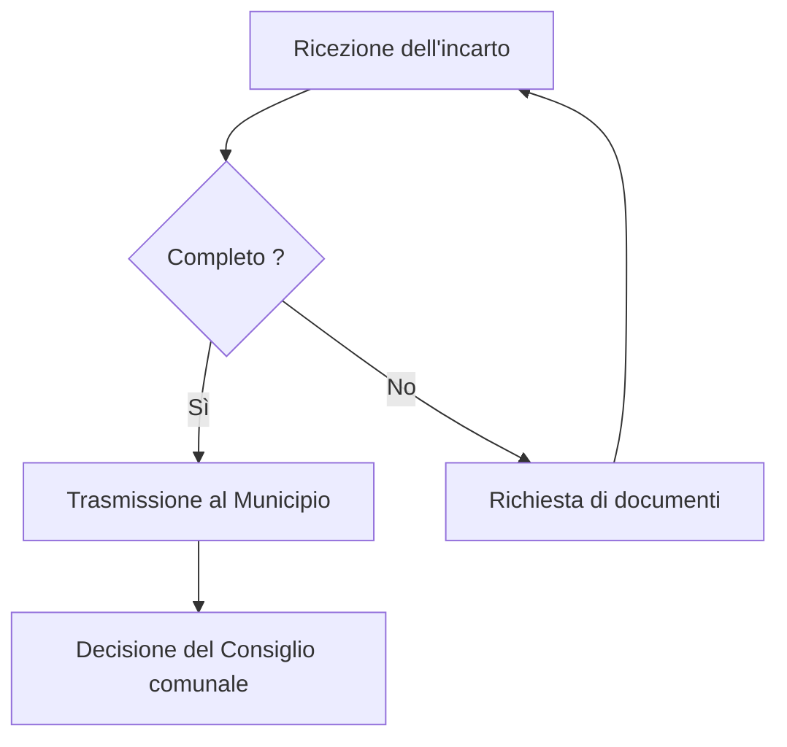

# Rapporto annuale 2026

Il Municipio di [[Losone]] ha approvato i conti dell'esercizio prima del 30 giugno, come
prescrive la legge organica comunale. La commissione della gestione si è riunita sette volte
durante l'anno e ha esaminato ogni credito superiore a centomila franchi.

> [!info] Documento di prova
> Questo rapporto serve a verificare la traduzione automatica: contiene deliberatamente del
> codice, dei diagrammi, una mappa e dei collegamenti che non devono essere tradotti.

## Conti

Le spese di gestione corrente ammontano a 4,2 milioni di franchi, in aumento del 3,1 per cento
rispetto all'esercizio precedente. Questo aumento si spiega con l'indicizzazione degli stipendi
e con la messa in servizio del teleriscaldamento del quartiere di [[Arcegno]].

| Voce | Importo | Scarto |
| --- | --- | --- |
| Spese correnti | 4,2 milioni | +3,1 % |
| Entrate fiscali | 4,0 milioni | −1,8 % |
| Ammortamenti | 620 000 | stabile |

Il grado di indebitamento resta contenuto. Per il calcolo si utilizza la funzione
`calcolaTotale()` prima di ogni esportazione, e i valori sono pubblicati integralmente su
[il sito comunale](https://ok-ia.ch/rapporto.html).

### Lavori conclusi

- Rifacimento del collettore delle acque luride di via Vignascia
- Risanamento energetico della sala multiuso
- Sostituzione dell'illuminazione pubblica con apparecchi a diodi
- [ ] Verifica dei conti prima del 30 giugno
- [x] Trasmissione al Consiglio comunale

```python
def calcola_totale(voci):
    """Somma le voci di spesa e restituisce il totale."""
    return sum(v.importo for v in voci if v.valida)
```

## Procedura

Il dossier segue la procedura qui sotto, invariata dal 2024.



## Territorio

I tre cantieri si trovano nel comparto sud del comune.

```leaflet
lat: 46.1700
long: 8.7500
zoom: 13
marker: 46.1712, 8.7534, [[Sala multiuso]]
marker: 46.1668, 8.7489, Collettore di via Vignascia
marker: 46.1745, 8.7601, Illuminazione pubblica
height: 380px
```

## Prospettive

Il Municipio intende proseguire il risanamento del patrimonio edilizio e avviare lo studio di
un nuovo collegamento con i trasporti pubblici verso il capoluogo del distretto. Una
consultazione pubblica sarà organizzata in primavera, e il preventivo 2027 prevede un'eccedenza
di spesa di 180 000 franchi, assorbibile dal capitale proprio.

Il testo integrale è consultabile all'indirizzo https://ok-ia.ch/losone/2026 senza registrazione.

## Entità

### Organizzazioni

- [[Municipio di Losone]]
- [[Consiglio comunale]]

### Luoghi

- [[Losone]]
- [[Arcegno]]
- [[Sala multiuso]]
